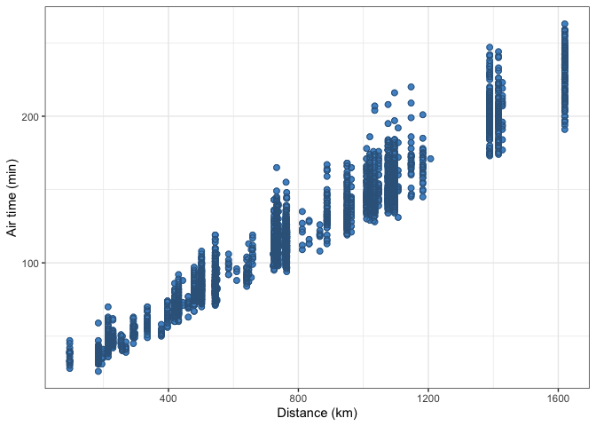
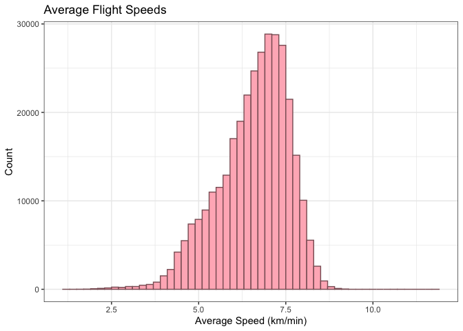

# Hmk_04 template: Data frames and data wrangling

Please read the entire [R for Data
Science](https://r4ds.hadley.nz/data-transform) before you do this
homework.

This homework relies on the `nycflights13` package, which contains
several data frames, including `airlines`, `airports`, `flights`,
`planes`, and `weather`. Loading `nycflights13`
(`library(nycflights13)`) puts all of these data frames on the search
path.

## Installing data packages

Remember that any package needs to be installed only once (per version
of R), but needs to be loaded every time we start a new R session.

To install `nyclflights13`, use `install.packages("nycflights13")` (with
quotation marks). To load it, use `library(nycflights13)`.

# Question 1: filtering

Make a plot of air time as a function of distance (air time on the y
axis, distance on the x axis) for all flights that meet the following
criteria:

- originate from LaGuardia airport (“LGA”)
- departed on the 16th of the month
- have a flight distance of less than 2000

``` r
library(tidyverse)
library(nycflights13)

LGA_short_16 <- flights |>
  filter(origin == "LGA" & day == 16 & distance < 2000, na.rm = TRUE)

ggplot(data = LGA_short_16, mapping = aes(x = distance, y = air_time)) +
  theme_bw() +
  geom_point(color="steelblue3", size = 2) +
  geom_point(shape = "circle open", color = "steelblue4", size = 2) +
  labs(x = "Distance (km)", y = "Air time (min)")
```



# Question 2: dealing with NAs

Make a data frame of all of the rows of `flights` that have values for
*both* `arr_time` and `dep_time` - that is, neither of those values are
`NA`.

``` r
arr_and_dep <- flights |>
  filter(!is.na(arr_time), !is.na(dep_time))
```

## filtering NAs

`ggplot()` will automatically remove NA values from the plot, as you may
have seen in question 1, but it emits a warning message about that. Of
course you could silence the warning message using [chunk
options](https://bookdown.org/yihui/rmarkdown-cookbook/chunk-options.html),
but how could you prevent them from appearing in the first place?

You could do this by filtering the data to get rid of NA values in each
variable, using the code I used in question 2:

filter(!is.na(variable_1), !is.na(variable_2))

# Question 3: adding columns

Create a data frame of average flight speeds, based on `air_time` and
`distance`. Make either a histogram or a density plot of the data. If
you like, you may break the data out (e.g. by airline, or some other
variable) in a way that you think makes sense.

``` r
avg_speed <- flights |>
  filter(!is.na(distance), !is.na(air_time)) |>
  mutate(
    avg.speed = distance / air_time)

ggplot(data = avg_speed, mapping = aes(x = avg.speed)) +
         theme_bw() +
         geom_histogram(binwidth = 0.2, color="lightpink4", fill="lightpink") +
         labs(x = "Average Speed (km/min)", y = "Count", title = "Average Flight Speeds")
```


