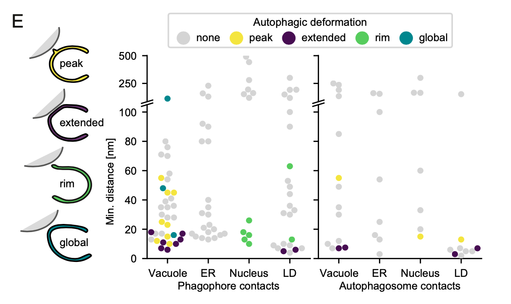
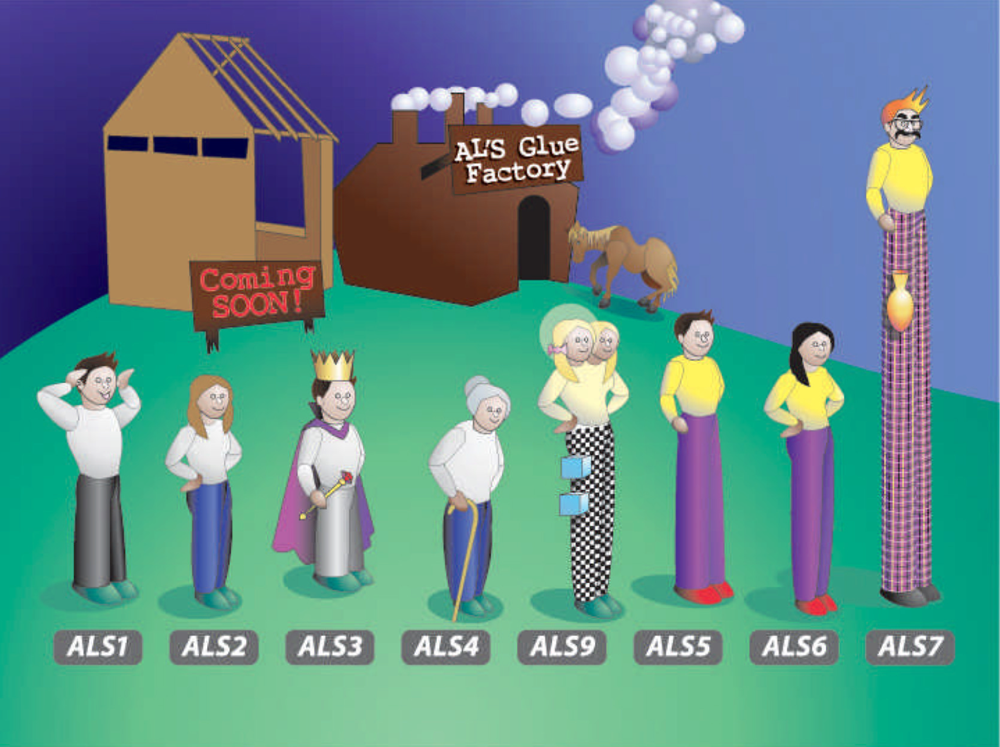
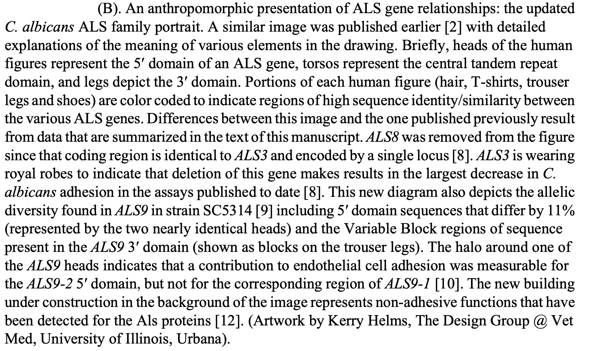

# hmk_06

# Homework 6

## 1. A Successful Data Visualization

### a. From Bieber *et al.*, 2022

This figure is describing the different organelles that phagophores and
autophagosomes (together, autophagic bodies) interact with, and hown the
autophagic bodies are deformed by those interactions. I think this is a
good visualization because it contains a lot of data in a relatively
small area, and is pretty easy to understand. They are able to include
information about the type of autophagic body, the organelle, the
distance between the two, and the way in which the autophagic body is
deformed, for every observation on the graph. The colors they chose
contrast well, and are able to be distinguished fairly well in black and
white (although I do think this could be improved). It is easy to see
every value for every point on the graph, and there aren’t any effects
that would make the data misleading.

## 2. An Unsuccessful Data Visualization

### a. From Hoyer *et al.*, 2008

 

Yes, this is from a real scientific article. It’s so bad that I’ve
included a second bad example, because I’m not honestly sure if this
even counts as data visualization. This figure is meant to be comparing
the genetic features of the different *ALS* genes is *Candida albicans*.
I think this visualization is both ugly and bad. It was clearly made in
MS paint or something similar. The quality of the drawings is poor and
the colors are garish. It is also pretty difficult to understand, and it
is not really apparent what the figure is supposed to be saying without
the caption (which is why I included it). It’s not immediately obvious
that this figure even includes data at all. I understand that the
authors were trying to make something whimsical, but trying to extract
any meaning from this figure is difficult.

### b. From Gralka *et al.*, 2023

I think this visualization is somewhat confusing; not ugly or wrong, but
bad. This graph shows the growth of different marine isolates on minimal
media with different carbon sources. There are so many lines on a single
graph, and they overlap so much, that is is hard to see what any
individual line is doing. I like the way they are color coded, but it is
unclear what the gray lines are meant to represent. They also did not
include axes labels on the y axis, so you can’t tell what the scale is
or what the tick marks are.
