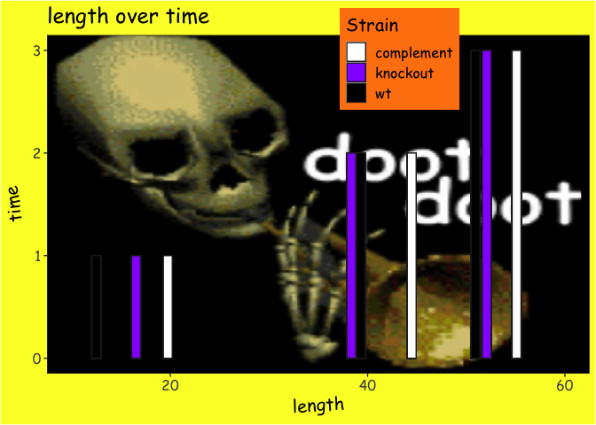
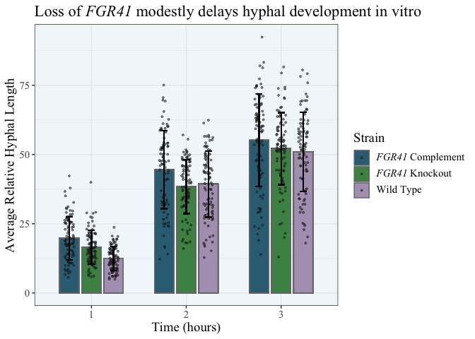

# Homework 7

## Bad Plot

``` r
library(tidyverse)
library(png)
library(ggpubr)

hyphal_length <- read_csv("data/hyphal_length.csv")

glimpse(hyphal_length)
```

    Rows: 810
    Columns: 5
    $ Strain      <chr> "wild_type", "wild_type", "wild_type", "wild_type", "wild_…
    $ Well        <dbl> 1, 1, 1, 1, 1, 1, 1, 1, 1, 1, 1, 1, 1, 1, 1, 1, 1, 1, 1, 1…
    $ Observation <dbl> 1, 2, 3, 4, 5, 6, 7, 8, 9, 10, 11, 12, 13, 14, 15, 16, 17,…
    $ Measure     <dbl> 10.858, 10.853, 19.425, 12.867, 20.572, 18.634, 8.769, 11.…
    $ Hour        <dbl> 1, 1, 1, 1, 1, 1, 1, 1, 1, 1, 1, 1, 1, 1, 1, 1, 1, 1, 1, 1…

``` r
# Find average length
average_lengths <- mutate(hyphal_length,
   average.length = mean(Measure),
  .by = c("Hour", "Strain"))

#Load background image
img <- readPNG("images/doot.png")

# Make plot
ggplot(average_lengths, aes(x = average.length, y = Hour, fill = Strain)) +
  
  # Add background image
  background_image(img) +
  
  # Add bars
  geom_bar(stat = "identity", position=position_dodge(width = 1), width = 0.9, color = "#222222") +
  
  #Set bar colors and legend labels
  scale_fill_manual(values = c("#FFFFFF", "#960DFF", "#000000"),
                   labels = c("complement", "knockout", "wt")) +
  
  #Set x and y scales
  xlim(10, 60) +
  ylim(0, 3) +
  
  # Set axis labels and title
  labs(x = "length", y = "time", title = "length over time") + 
  
  #Theme
  theme_bw() + 
  theme(text = element_text(family = "Comic Sans MS", size = 15),
        plot.background = element_rect(fill = "#FBFF2F"), 
        legend.background = element_rect(fill = "#FF820D"), 
        axis.title.x = element_text(angle=3),
        axis.title.y = element_text(angle=97),
        legend.position = c(0.65, 0.93))
```



The data used for this plot describe the average length of the hyphae of
different *C. albicans* strains after 1, 2, and 3 hours. In order to
make this plot unsuccessful, I actually first made the good version of
the plot (below). I then sought to make it a “bad” plot by transforming
it into something ugly, bad, and wrong, according to Wilke’s
definitions. I suggest that this plot is all of these things, for the
following reasons:

- The colors chosen are bright, clashing, and overall difficult to look
  at. All of the text is in comic sans, and the labels are crooked.

- The background image distracts from the actual plot and obscures some
  of the data. The fact that the image is mostly black, and some of the
  bars are black, makes those bars difficult to see. The white bars also
  blend in, giving the impression that the purple ones are the most
  important.

- The x and y axes are flipped from what is shown in the good plot, and
  this makes it unintuitive to read. A lot of ink is also wasted in
  having three bars that go to the same height, which Tufte would not
  like.

- The x axis does not start at 0, but in fact starts at 10. This is not
  displayed on the graph anywhere, and it looks like it starts at 0. It
  is also impossible to tell what length value the bars are actually at.

- The axis labels, title, and legend are not very descriptive. You have
  no idea what it is plotting the length of, what the units are for
  either axis, or what gene the legend is talking about (or even that
  we’re talking about a gene at all).

- Only the average length measurement is displayed. You cannot see the
  actual data points or the standard deviation, so you are unable to
  tell what the spread of the data looks like.

## Good Plot

``` r
library(tidyverse)
library(ggtext)

hyphal_length <- read_csv("data/hyphal_length.csv")

glimpse(hyphal_length)
```

    Rows: 810
    Columns: 5
    $ Strain      <chr> "wild_type", "wild_type", "wild_type", "wild_type", "wild_…
    $ Well        <dbl> 1, 1, 1, 1, 1, 1, 1, 1, 1, 1, 1, 1, 1, 1, 1, 1, 1, 1, 1, 1…
    $ Observation <dbl> 1, 2, 3, 4, 5, 6, 7, 8, 9, 10, 11, 12, 13, 14, 15, 16, 17,…
    $ Measure     <dbl> 10.858, 10.853, 19.425, 12.867, 20.572, 18.634, 8.769, 11.…
    $ Hour        <dbl> 1, 1, 1, 1, 1, 1, 1, 1, 1, 1, 1, 1, 1, 1, 1, 1, 1, 1, 1, 1…

``` r
# Find average and standard deviation
average_lengths <- mutate(hyphal_length,
   average.length = mean(Measure),
   stdev = sd(Measure),
  .by = c("Hour", "Strain"))

# Make plot
ggplot(average_lengths, aes(x = Hour, y = average.length, fill = Strain)) +
  
  #Make bar plot, separated by hour
  geom_bar(stat = "identity", position=position_dodge(width = 0.7), width = 0.6, color = "#777777") +
  
  #Set colors and legend labels
  scale_fill_manual(values = c("#336D83", "#4A9053", "#B0A0BE"),
                    labels = c("*FGR41* Complement", "*FGR41* Knockout", "Wild Type")) +
  
  #Set x axis tick marks and label
  scale_x_discrete(name ="Time (hours)", 
                    limits=c("1","2","3")) +
  
  # Set y axis label and title
  labs(y = "Average Relative Hyphal Length", title = "Loss of *FGR41* modestly delays hyphal development in vitro") + 
  
  #Theme
  theme_bw() + 
  theme(panel.background = element_rect(fill = "#F1F8FB"), 
        text = element_text(family = "Times New Roman", size = 14), 
        plot.title = ggtext::element_markdown(), 
        legend.text = ggtext::element_markdown()) +
  
  # Add points
  geom_point(data = average_lengths, mapping = aes(x = Hour, y = Measure),
             position=position_jitterdodge(jitter.width = 0.1, jitter.height = 0, dodge.width = 0.7), 
             size = 0.7, color = "#222222", alpha = 0.5) +
  
  # Add error bars
  geom_errorbar(width = 0.2, color = "#000000", 
                aes(ymin = average.length+stdev, ymax = average.length-stdev),
                position=position_dodge(width = 0.7))
```


